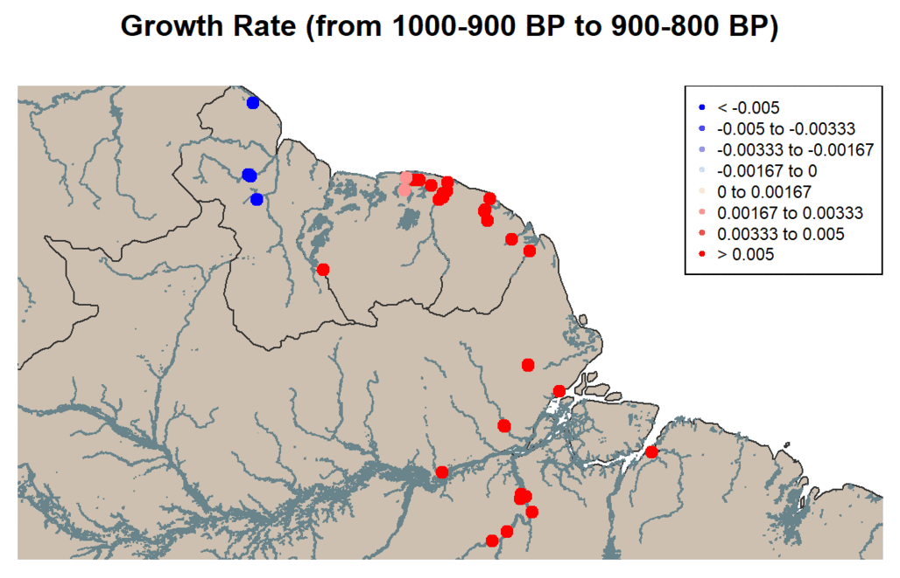
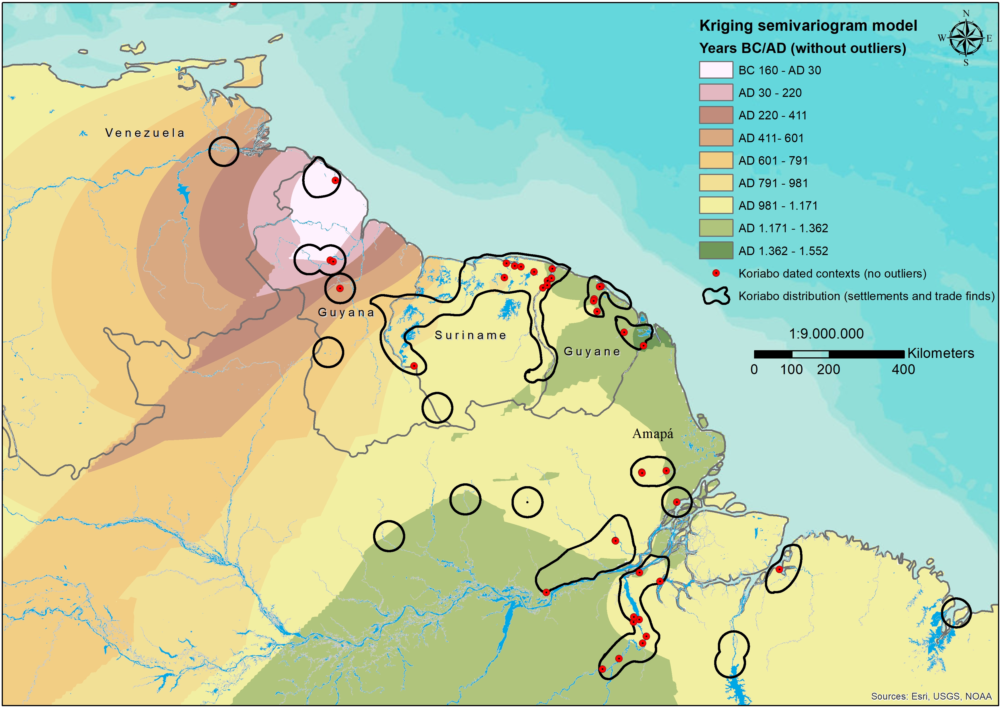

```{r setup, include=FALSE, cache = FALSE, autodep = TRUE}
knitr::opts_chunk$set(echo = TRUE, autodep = TRUE)
```

## Abstract

From AD 1200 to 1500, a pottery style called Koriabo appeared in most parts of Northern Amazonia, including the Guianas and the Lower Amazon. Such ceramics were displayed persistence in the Caribbean by the time of the first colonial enterprises, in settlements dated between the 16th and 17th centuries in the Lesser Antilles, understood as related to the Kalinago peoples. Despite its distribution over a vast territory, the homogeneity of decorative forms and vessel shapes is a striking characteristic of such ceramics, whose radiocarbon datings mostly range from AD 1000 to 1500 in Amazonia. Some have raised that Koriabo pottery should be understood as one of the archaeological correlates of the Carib-speaking peoples, due to its presence being matched with places historically occupied by them. On the other hand, others agree that such assemblage is a phenomenon more related to the making of long-distance exchange networks. The hypothesis raised here advocates that Koriabo could be explained by a two-folded process, which includes the making and reproduction of exchange networks, as well as demic diffusion. While the first process is related to the concept of "cultural transmission", the second one is translated into substantial population movements. Such expansions probably occurred at a rapid rhythm and created more homogeneous patterns of archaeological visibility. One of the archaeological models for Carib-language expansion points out that the last expansion step was initiated by AD 1000 when the growth of population and the strengthening of exchange networks provoked a diasporic movement towards the regions known by the time of first colonial encounters. The purpose of this paper is to discuss these ideas by using GIS and time-series modeling of radiocarbon dates.

**Keywords:** Koriabo Pottery, Amazonia, Carib-speaking peoples, Exchange Networks, Demic Diffusion

#### Loading Libraries
```{r Loading Libraries, message = FALSE}
library(tidyverse)
library(rcarbon)
library(rnaturalearth)
library(sf)
library(prettymapr)
library(knitr)
library(leaflet)
library(leaflet.extras)
library(sp)
library(rgdal)
library(magrittr)
```


## Introduction
This document is intended to show only the code and plot results of the radiocarbon modeling for Koriabo pottery, made up by means of the [rcarbon](https://cran.r-project.org/web/packages/rcarbon/index.html) package. It does not contain interpretation for the archaeological analysis.

```{r load_shapefiles, message = FALSE, warning = FALSE}
# Loadding required shapefiles
koriaboPottery <- sf::read_sf("data_raw/koriabo.shp", crs = 4326)             # Shapefile for the distribution of Koriabo pottery
caribanLanguages <- sf::read_sf("data_raw/cariban_languages.shp", crs = 4326) # Shapefile for the distribution of Cariban Languages
ethnomies <- sf::read_sf("data_raw/group_ethnomies.shp", crs = 4326)          # Shapefile for group ethnomies base on Nimuendaju's map
water <- sf::read_sf("data_raw/sa_water.shp", crs = 4326)                     # Shapefile of Hydrography
world <- rnaturalearth::ne_countries(scale = 'medium', type = 'map_units', returnclass = 'sf') # Loading world layer vector
dated_sites <- read.csv("data_raw/dated_sites.csv") %>%                       #Dates sites with Koriabo Pottery
  st_as_sf(
    coords = c(2, 3),
    crs = 4326
  )

```


```{r plot_maps, include = FALSE, eval = FALSE, out.width = "100%", warning = FALSE, message = FALSE, results = 'hide'}

par(mar = c(1,1,1,1), mfrow = c(1,1))

#par(mar = c(1, 1, 1, 1), mfrow = c(2,1))

plot(world$geometry,
     col = "antiquewhite3",
     border = "gray20",
     xlim = c(-76, -43),
     ylim = c(-14, 12),
     bgc = alpha("lightblue", 0.5),
     main = "Distribution of Cariban Languages"
)

plot(
  water$geometry,
  col = alpha("lightblue4", 0.35),
  border = alpha("lightblue4", 0.35),
  add = TRUE
)

plot(caribanLanguages$geometry, 
     col = alpha("red", 0.5),
     border = alpha("gray20", 0.3),
     add = TRUE
)

addnortharrow(
  pos = "topright",
  padin = c(0.15, 0.15),
  scale = 1,
  lwd = 1,
  border = "black",
  cols = c("white", "black"),
  text.col = "black")

addscalebar(
  plotunit = NULL,
  plotepsg = NULL,
  widthhint = 0.25,
  unitcategory = "metric",
  htin = 0.1, padin = c(0.15, 0.15),
  style = "bar",
  bar.cols = c("black", "white"),
  lwd = 1,
  linecol = "black",
  tick.cex = 0.7,
  labelpadin = 0.08,
  label.cex = 0.8,
  label.col = "black",
  pos = "bottomright")


plot(world$geometry,
     col = "antiquewhite3",
     border = "gray20",
     xlim = c(-76, -43),
     ylim = c(-14, 12),
     bgc = alpha("lightblue", 0.5),
     main = "Distribution of Koriabo Pottery"
)

plot(
  water$geometry,
  col = alpha("lightblue4", 0.35),
  border = alpha("lightblue4", 0.35),
  add = TRUE
)

plot(koriaboPottery$geometry, 
     col = alpha("red", 0.5),
     border = alpha("gray20", 0.3),
     add = TRUE
)

addnortharrow(
  pos = "topright",
  padin = c(0.15, 0.15),
  scale = 1,
  lwd = 1,
  border = "black",
  cols = c("white", "black"),
  text.col = "black")

addscalebar(
  plotunit = NULL,
  plotepsg = NULL,
  widthhint = 0.25,
  unitcategory = "metric",
  htin = 0.1, padin = c(0.15, 0.15),
  style = "bar",
  bar.cols = c("black", "white"),
  lwd = 1,
  linecol = "black",
  tick.cex = 0.7,
  labelpadin = 0.08,
  label.cex = 0.8,
  label.col = "black",
  pos = "bottomright")

```

Click on the features below to see the information about Ethnonyms and Archaeological sites.  
[**Click here to see this map in a full screen page**](https://barretobrunosb.github.io/cariban_map/)
```{r interactive_map, echo = FALSE, out.width = "100%", warning = FALSE, message = FALSE}

#Variable for filtering ethnomies and early register dates
m_ethnonym <- c("Select All", as.character(sort(unique(ethnomies$Etnomio))))
m_earlydate <- c("Select All", as.character(sort(unique(ethnomies$early_date))))

#Setting up all the values as character
s2_ethnonym <- as.character(sort(unique(ethnomies$Etnomio)))
s2_earlydate <- as.character(sort(unique(ethnomies$early_date)))

#Building a filter function
#filt_map <- reactive({
#  ethnomies %>% 
#    filter(
#      if (input$m_ethnonym == "Select All") {Etnomio %in% s2_ethnonym} else {Etnomio == #input$m_ethnonym},
#      if (input$m_earlydate == "Select All") {early_date %in% s2_earlydate} else {early_date == #input$m_earlydate}
#    )
#})


# selectInput("country", "Choose a country to filter the dated sites",
#             choices = c(
#               "Select All",
#               "Guyana",
#               "Suriname",
#               "French Guiana",
#               "Brazil (Amapá)",
#               "Brazil (Pará)"),
#             selected = "Select All") 
# 
# Country <- reactive({
#   switch(input$country,
#          "Select All" = dated_sites,
#          "Guyana" = dated_sites$country[subset(dated_sites, country == "Guyana")],
#          "Suriname" = dated_sites$country[subset(dated_sites, country == "Suriname")],
#          "French Guiana" = dated_sites$country[subset(dated_sites, country == "French Guiana)")],
#          "Brazil (Amapá)" = dated_sites$country[subset(dated_sites, country == "Brazil (Amapa)")],
#          "Brazil (Para)" = dated_sites$country[subset(dated_sites, country == "Brazil (Para)")]
#          )
# })


mapPopup1 <- paste(
  "Ethnonym:", ethnomies$Etnomio, "<br>",
  "Early Register:", ethnomies$early_date, "<br>",
  "Late Register:", ethnomies$late_date, "<br>")

mapPopup2 <- paste(
  "Site:", "<br>",
  dated_sites$site, "<br>",
  "Oldest Date:", "<br>",
  dated_sites$c14oldest_date_bp, "+/-", dated_sites$standard_dev, "BP", "<br>",
  "Ocupation Interval:", "<br>",
  "BC/AD", dated_sites$cal_early, "to", dated_sites$cal_late, "<br>")


leaflet() %>% 
  setView(lng = -60, lat = 2, zoom = 4.5) %>% 
  
  #Basemap layers and Minimap
  addProviderTiles(providers$Esri.WorldTerrain, group = "ESRI Terrain") %>%
  addProviderTiles(providers$OpenTopoMap, group = "Open Topographical") %>%
  addTiles(group = "Open Street Map") %>%
  addProviderTiles(providers$Esri.WorldImagery, group = "ESRI Imagery") %>%
  addMiniMap(position = "bottomleft") %>%
  

  #Layers Cariban/Koriabo
  addPolygons(data = water, color = "lightblue", stroke = FALSE, opacity = 1, fillOpacity = 1, group = "Main Rivers") %>% 
  
  addPolygons(data = caribanLanguages, color = alpha("red", 0.3), group = "Cariban Languages") %>% 
  
  addPolygons(data = ethnomies, color = "darkgrey", opacity = 1, highlight = highlightOptions(color = "yellow", fillOpacity = .9, bringToFront = FALSE ), group = "Ethnomies", popup = mapPopup1) %>% 
  
  addPolygons(data = koriaboPottery, color = "blue", group = "Koriabo Pottery") %>%
  
  addCircles(data = dated_sites,
      lat = ~lat,
      lng = ~long,
      weight = 1,
      radius = ~c14oldest_date_bp*15,
      color = "black",
      fillColor = "black",
      highlight = highlightOptions(color = "yellow", fillOpacity = .9, bringToFront = TRUE),
      popup = mapPopup2,
      group = "Dated Sites",
      opacity = 2) %>%

  #Layers Control
  addLayersControl(
    position = "topright",
    baseGroups = c("ESRI Terrain", "Open Topographical", "ESRI Imagery", "Open Street Map"),
    overlayGroups = c("Cariban Languages", "Ethnomies", "Koriabo Pottery", "Dated Sites", "Main Rivers"),
    options = layersControlOptions(collapsed = FALSE)
  ) %>% 

  #Legends
  addLegend(
    position = "topright",
    values = c(caribanLanguages, ethnomies, koriaboPottery, dated_sites),
    colors = c("red", "darkgrey", "blue", "black"),
    labels = c("Cariban Languages", "Ethnomies", "Koriabo Pottery", "Dated Sites")) %>% 
  
  #Measure widget
  addMeasure(primaryLengthUnit = "kilometers", primaryAreaUnit = "kilometers")


```


## Radiocarbon modeling
96 radiocarbon dates are being considered in this chronological model. Most of radiocarbon dates comes from French Guiana, in reason of a higher intensity of archaeological research during the last two decades. Except in Western Guiana, whose the radiocarbon dates are much older and present wider standard deviations, the average mean for the whole set of radiocarbon dates is placed on AD 1250-1350 (in French Guiana, Suriname, Amapá and Xingu-Iriri Rivers).

#### **Preparing the data**
```{r raw_data, cache = TRUE, cache.extra = file.info("data_raw/c14dates.csv")}
# Creation and management of data frame for all radiocarbon dates
c14dates <- read.csv("data_raw/c14dates.csv")                # reading the CSV file with radiocarbon dates
c14dates$site <- factor(c14dates$site)                       # converting the column 'dates' in a factor
c14dates$country_state <- factor(c14dates$country_state)     # converting the column 'country_state' in a factor
#c14dates$region <- factor(c14dates$region)                   # converting the column 'region' in a factor 
c14dates$culture <- factor(c14dates$culture)                 # converting the column 'culture' in a factor

```


#### **Calibrating ^14^C Dates**
```{r calibration, message = FALSE, results = 'hide', cache = TRUE, dependson = "raw_data"}
# Calibrating the radiocarbon dates

c14koriabo <- subset(c14dates, culture == "1 - Koriabo") # Extracting a Koriabo subset of Radiocaron dates

c14calibration_koriabo <- calibrate(
  x = c14koriabo$age,          # The radiocarbon age for each of the 135 radiocarbon dates
  errors = c14koriabo$std,     # Standard deviation of each radiocarbon date
  method = "mixed",            # Method for mixing the radiocarbon atmospheric curves
  mixed.curves = TRUE,         # Enabling the argument for mixing the atmospheric curves
  intcal20 = intcal20(),       # Calling the IntCal20 atmospheric curve for Northern Hemisphere
  shcal20 = shcal20(),         # Calling the ShCal20 atmospheric curve for Southern Hemisphere
  normalised = FALSE           # The data are not normalized in order to avoid false peaks in the SPD model
)

# Creating a Time Range object for running the analyses
timeRange <- c(
  2300,  # Starting point on 2300 BP (BC 300)
  300    # Ending point on 300 BP (AD 1700)
) 
```

#### **The total amount of radiocarbon dates**
Most radiocarbon dates ranges from AD 1000 to 1500. There's a peak on AD 1250-1350 which is consistent with a expasion towards the lower Amazon, including some parts of Amapá, and also the Xingu-Iriri rivers.

```{r boxplot_c14dates, echo = FALSE, message = FALSE, fig.align = 'center'}

#Normal boxplot
boxplot_dates <- ggplot(c14koriabo, aes(x = region, y = age, fill = region), xlab = "Age (years BP)")
boxplot_dates <- boxplot_dates + xlab("Region") + ylab("Age (years BP)")
boxplot_dates <- boxplot_dates +stat_boxplot(geom = "errorbar", width = 0.2)
boxplot_dates <- boxplot_dates + geom_boxplot(outlier.colour = "red")
boxplot_dates <- boxplot_dates + stat_summary(fun.data = mean_cl_normal, geom = "linerange", colour = "black", linewidth = 4, alpha = 0.3)
boxplot_dates <- boxplot_dates + stat_summary(fun = mean, geom = "point", colour = "orange", size = 2)
boxplot_dates <- boxplot_dates + geom_jitter(color = "black", size = 1)
boxplot_dates <- boxplot_dates + theme_classic()
boxplot_dates <- boxplot_dates + labs(title = "Box Plot")
boxplot_dates <- boxplot_dates + labs(subtitle ="Distribution of radiocarbon ages by region")

#Violin boxplot
boxplot_violin <- ggplot(c14koriabo, aes(x = region, y = age, fill = region), xlab = "Age (years BP)")
boxplot_violin <- boxplot_violin + xlab("Region") + ylab("Age (years BP)")
boxplot_violin <- boxplot_violin + geom_violin()
boxplot_violin <- boxplot_violin +stat_boxplot(geom = "errorbar", width = 0.2)
boxplot_violin <- boxplot_violin + stat_summary(fun.data = mean_cl_normal, geom = "linerange", colour = "black", linewidth = 4, alpha = 0.3)
boxplot_violin <- boxplot_violin + stat_summary(fun = mean, geom = "point", colour = "orange", size = 2)
boxplot_violin <- boxplot_violin + geom_jitter(color = "black", size = 1)
boxplot_violin <- boxplot_violin + theme_classic()
boxplot_violin <- boxplot_violin + labs(title = "Violin BoxPlot")
boxplot_violin <- boxplot_violin + labs(subtitle ="Distribution of radiocarbon ages by region")
  
  
plot(boxplot_dates) 
plot(boxplot_violin) 
```

### **Summed Probability Distribution (SPD) and a Growth Population Model**
#### Step 1 - The SPD Model
```{r SPD_model, results = 'hide', cache = TRUE}
spd_koriabo <- spd(                  # Generation fo the SPD of Santarém radiocarbon dates
  c14calibration_koriabo,            # Using the Koriabo radiocarbon calibrations
  timeRange = timeRange              # Time Range from 2300 BP to 300 BP 
)
```

```{r plot_SPD, echo = FALSE, fig.align = 'center', out.width = '100%'}
plot(
  spd_koriabo,            #SPD object for all Radiocarbon dates
  calendar = 'BCAD',      #Plot the SPD Model in BC/AD years
  main = "14C Summed Probability Distribution of Koriabo Pottery" #Label
  )

plot(                     #Plotting the smoothing line with a bin value of 200 years
  spd_koriabo,           #SPD object for all radiocarbon dates
  calendar = 'BCAD',      #Calendar in BC/AD years
  runm = 200,             #Smoothed distribution with a binning of 200 years
  add = TRUE,             #Add the line
  type = "simple",        #Simple line
  col = "red",            #Line colour = Red
  lwd = 2,                #Line Thickness = 2
  lty = 2
)
```

#### Step 2 - Binning the SPD Model
```{r binning_SPD, results = 'hide'}
bins_c14calibration <- binPrep(    # Generation of an object for the bins
  sites = c14koriabo$site,     # Column for archaeological sites
  ages = c14koriabo$age,       # Column with the radiocarbon age values
  h = 100                      # Parameter for binning between an interval of 100 years
  )

binned_spd_koriabo <- spd(        # Generation of the final binned SPD model 
  c14calibration_koriabo,          # Object with all the unnormalised radiocarbon dates
  bins = bins_c14calibration,      # Object with the bins values for binning the model
  timeRange = timeRange,           # Time Range of the analysis frmo 2300 to 300 BP
)
```
```{r plot_binned_SPD, echo = FALSE, fig.align = 'center', out.width = '100%'}
plot(
  binned_spd_koriabo,    #SPD object for all Radiocarbon dates
  calendar = 'BCAD',      #Plot the SPD Model in BC/AD years
  main = "Binned Radiocarbon SPD of Koriabo Pottery" # Plot Title
)

plot(                     #Plotting the smoothing line with a bin value of 200 years
  binned_spd_koriabo,     #SPD object for all radiocarbon dates
  calendar = 'BCAD',      #Calendar in BC/AD years
  runm = 200,             #Smoothed distribution with a binning of 200 years
  add = TRUE,             #Add the line
  type = "simple",        #Simple line
  col = "red",            #Line colour = Red
  lwd = 2,                #Line Thickness = 2
  lty = 2
)
```
```{r plot_binsense, echo = FALSE, results = 'hide', fig.align='center', out.width = '100%'}
binsense <- binsense(
  x = c14calibration_koriabo,
  y = c14koriabo$site,
  h = seq(0, 300, 100),
  calendar = 'BCAD',
  timeRange = timeRange
)
```


#### Step 3 - ^14^C Kernel Density Estimation Model (KDE)
```{r KDE, results = 'hide'}
C14randates <- sampleDates(
  c14calibration_koriabo,
  bins = bins_c14calibration,
  nsim = 100,
  verbose = FALSE
)

c14koriabo_ckde <- ckde(
  C14randates,
  timeRange = timeRange,
  bw = 100
)
```

```{r plot_kde, echo = FALSE, fig.align = 'center', out.width = '100%'}
plot(
  c14koriabo_ckde,
  type = 'multiline',
  calendar = 'BCAD',
  xlim = c(-200, 1600),
  main = "14C Kernel Density Estimation (KDE) for Koriabo Pottery"
)
```

#### Step 4 - Exponential Growth Model
```{r exp_model, results = FALSE, warning = FALSE, message = FALSE}
c14koriabo_expnull <- modelTest(
  c14calibration_koriabo,
  errors = c14koriabo$std,
  bins = bins_c14calibration,
  nsim = 100,
  timeRange = c(2500,0),
  model = "exponential",
  runm = 100
)
```

```{r plot exp_model, echo = FALSE, warning = FALSE, fig.align = 'center', out.width = '100%'}
plot(c14koriabo_expnull,
     calendar = 'BCAD',
     lwd = 2,
     main = "Exponential Growth Model (Koriabo)"
)
summary(c14koriabo_expnull)

```


```{r plot_localgrowth, echo = FALSE, out.width = '100%'}
plot(c14koriabo_expnull, type = 'roc', lwd = 2, main = 'Local Growth Change Rates')
```


#### Step 5 - Permutation Test by Region
```{r perm_test, results = FALSE}
permTest_region <- permTest(
  x = c14calibration_koriabo,
  marks = c14koriabo$region,
  timeRange = c(2700,0),
  bins = bins_c14calibration,
  nsim = 100,
  runm = 50
)

```

```{r stackCalSPD, warning = FALSE}
permTest_region_stack_spd <- stackspd(
  x = c14calibration_koriabo,
  group = c14koriabo$region,
  timeRange = c(3000,0),
  bins = bins_c14calibration,
  runm = 50,
  verbose = FALSE
)
```


```{r plot_permtest, echo = FALSE, out.width = '100%'}
par(mar = c(2,2,2,2), mfrow = c(5,1))
plot(permTest_region, focalm = 1, calendar = 'BCAD', lwd = 2, main = "Western Guiana")
plot(permTest_region, focalm = 2, calendar = 'BCAD', lwd = 2, main = "Suriname")
plot(permTest_region, focalm = 3, calendar = 'BCAD', lwd = 2, main = "French Guiana")
plot(permTest_region, focalm = 4, calendar = 'BCAD', lwd = 2, main = "Amapa-Estuary")
plot(permTest_region, focalm = 5, calendar = 'BCAD', lwd = 2, main = "Xingu-Iriri Rivers")

```
```{r plot stack_spd, echo = FALSE, out.width = '100%'}
par(mfrow=c(1,1))
plot(permTest_region_stack_spd, type = 'multipanel',  calendar = 'BCAD')
```

#### Step 6 - Spatial Permutation Test
```{r spatial_perm, results = FALSE}
allsites <- unique(data.frame(id = c14koriabo$site, lat = c14koriabo$lat, long = c14koriabo$long))

allsites <- st_as_sf(allsites, coords = c('long','lat'), crs = 4326)

breaks <- seq(1200,500,-100)

timerange_spatialperm <- c(1200,500)

koriabo_spd <- spd(
  x = c14calibration_koriabo,
  bins = bins_c14calibration,
  timeRange = timerange_spatialperm
)

spatial_perm <- sptest(
  calDates = c14calibration_koriabo,
  bins = bins_c14calibration,
  timeRange = timerange_spatialperm,
  locations = allsites,
  locations.id.col = 'id',
  h = 100,
  kernel = 'gaussian',
  permute = 'locations',
  nsim = 100,
  breaks = breaks,
  ncores = 1,
  verbose = FALSE
)

world <- ne_countries(scale = 'medium', type = 'map_units', returnclass = 'sf')

xrange <- st_bbox(allsites)[c(1,3)]
yrange <- st_bbox(allsites)[c(2,4)]

```


```{r plot_GRates, echo = FALSE, out.width = '100%'}
plot(spd2rc(koriabo_spd, breaks = breaks), main = 'Radiocarbon SPD Growth Rates of Koriabo Pottery')
```
```{r plot_spatialTest, eval = FALSE, echo = FALSE, results = 'hide', fig.show = 'hide', out.width= '100%'}
opts_chunk$set(echo = FALSE, out.width = '100%', fig.align = 'center')
#Setting up the page output format of the Spatial Permutation Test
#par(mar=c(2,2,2,2), mfrow=c(2,1))

#Plot 1
plot(world$geometry,
     col = "antiquewhite3",
     border = "gray20",
     xlim = xrange,
     ylim = yrange,
     main = "Growth Rate (from 1000-900 BP to 900-800 BP)"
)

plot(
  water$geometry,
  col = alpha("lightblue4", 0.35),
  border = alpha("lightblue4", 0.35),
  add = TRUE
)


plot(spatial_perm,
     index = 3,
     option = "raw",
     add = TRUE,
     breakRange = c(-0.005,0.005),
     breakLength = 7,
     rd = 5,
     legend = TRUE,
     alpha = 1.5,
     legSize = 0.7,
     baseSize = 1.7,
     location = "topright")

#Plot 2
plot(world$geometry,
     col = "antiquewhite3",
     border = "gray20",
     xlim = xrange,
     ylim = yrange,
     main = "Growth Rate (from 900-800 BP to 800-700 BP)"
)

plot(
  water$geometry,
  col = "lightblue4",
  border = "lightblue4",
  add = TRUE
)

plot(spatial_perm,
     index = 4,
     option = "raw",
     add = TRUE,
     breakRange = c(-0.005,0.005),
     breakLength = 7,
     rd = 5,
     legend = TRUE,
     legSize = 0.7,
     baseSize = 1.7,
     location = "topright")

#Plot 3
plot(world$geometry,
     col = "antiquewhite3",
     border = "gray20",
     xlim = xrange,
     ylim = yrange,
     main = "Growth Rate (from 800-700 BP to 700-600 BP)"
)

plot(
  water$geometry,
  col = "lightblue4",
  border = "lightblue4",
  add = TRUE
)

plot(spatial_perm,
     index = 5,
     option = "raw",
     add = TRUE,
     breakRange = c(-0.005,0.005),
     breakLength = 7,
     rd = 5,
     legend = TRUE,
     legSize = 0.7,
     baseSize = 1.7,
     location = "topright")


```

```{r plot_gif, echo = FALSE, fig.align = 'center', out.width = '100%'}

```
##  **Interpolation of calibration span for all dated sites (Kriging)**
The interpolation of Radiocarbon dates(Kriging) shows faster expansion movements started by 800 AD towards the Guiana shield and lower Amazon. It probably consisted of a demic diffusion model with substantial population movements.

```{r kriging_map, echo = FALSE, fig.align = "center", out.width = "100%"}

```


##  **Multi Origin-Destination Least Cost Path Analysis**
Ongoing work


